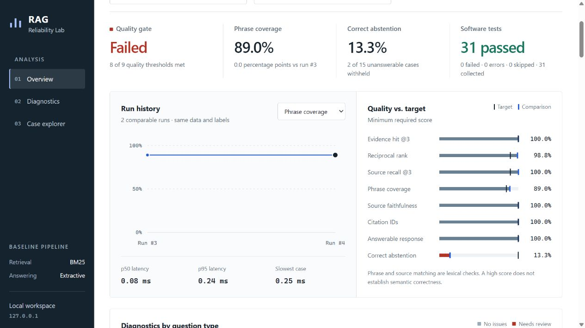

# Reliability Lab

## LLM test-generation benchmark

Can adding documentation help an LLM generate better tests? This experiment compares
code-only and code-plus-documentation prompts on **24 Python functions and 48 seeded
bugs**, with 8 development functions and 16 held-out functions. A suite must pass
the correct implementation before earning any bug-detection credit.

Read the [case study](docs/TEST_GENERATION_CASE_STUDY.md) or
[reproduction guide](docs/TEST_GENERATION.md). The offline HTML viewer exposes every
generated assertion and observed result. Exact prompts, model digests, frozen plans
and raw responses make the measurements inspectable. Python standard library;
no additional runtime dependencies.

**API-key models:** OpenAI, Claude, Gemini, Grok, DeepSeek, Groq, OpenRouter and
custom OpenAI-compatible endpoints are supported alongside Ollama. The
[setup guide](docs/API_MODELS.md) covers local key configuration, model settings,
and offline comparison reports. Hosted API adapters are tested with local HTTP
stubs. Existing Codex and Cursor logins support separate subscription CLI runs;
see the [subscription guide](docs/SUBSCRIPTION_BENCHMARK.md).

**Subscription model evaluation (13 September 2026):** the
[study and evidence index](reports/testgen/subscriptions-2026-09-13/README.md) and
[HTML comparison](reports/testgen/subscriptions-2026-09-13/comparison.html) compare
the available GPT, Grok and Composer models on the same 16-function split.
The catalog and account-availability record distinguish completed runs from
Cursor entries blocked by subscription quota. Each model links to its original
generated tests and execution evidence.

**Original local Qwen experiment:** [results](reports/testgen/heldout.md) ·
[HTML evidence viewer](reports/testgen/heldout.html) ·
[raw generations](reports/testgen/heldout.jsonl) ·
[frozen plan](reports/testgen/heldout-plan.json).
Download/open the HTML file locally to use its expandable evidence rows.

On the frozen 16-function test split, **Qwen2.5-Coder 3B caught 12/32 seeded bugs
(37.5%) in both conditions**. Code-only produced 9/16 valid suites; documentation
produced 8/16. There were no format, provider or execution failures. The paired
difference was 0 percentage points (95% task-bootstrap interval: -18.75 to +12.5).
This small experiment found no overall documentation gain; it does not establish
performance on real repositories. Software tests run independently of
those model-quality scores.

```bash
python -m raglab.testgen validate
python -m raglab.testgen demo
python -m raglab.testgen evaluate --input reports/testgen/heldout.jsonl --report reports/testgen/replay.json
```

The demo uses reference assertions and is labeled **no LLM used**. Its 100% score
validates the runner, not a model. Historical development attempts are preserved,
including formatting defects, wrong assertions and provider failures.

## RAG evaluation workbench

A local workbench for evaluating retrieval-augmented generation: run a benchmark, compare scores, and inspect the evidence behind each failed answer.

**56 benchmark cases · 12 source documents · zero runtime dependencies · Python 3.11+**

The included baseline uses BM25 retrieval and cited, extractive answers. It is deterministic, runs without API keys, and intentionally exposes a real limitation: finding related text does not mean a question can be answered. The current baseline meets 8 of 9 thresholds but correctly abstains on only **2 of 15 unanswerable questions**. Software tests and the RAG quality gate are reported separately.

## Example results



Recorded local pytest run **#4, 10 September 2026** · 56 custom cases · benchmark `97b3e6aa14c0`.

| Measurement | Recorded result |
|---|---:|
| Software tests | 31 passed, 0 failed |
| Source recall @3 | 100.0% |
| Required phrase coverage | 89.0% |
| Correct abstention | 13.3% (2 of 15) |
| Cases with diagnostic issues | 22 of 56 |
| RAG quality gate | **FAIL** — 8 of 9 thresholds met |

The useful finding is that complete source retrieval still produces incomplete or inappropriate answers. The evaluator exposes that gap instead of treating passing software tests as proof of answer quality. These are synthetic, lexical benchmark measurements, not production accuracy or public leaderboard scores.

Inspect the [case-by-case report](reports/latest.md) or the [machine-readable benchmark baseline](reports/baseline.json). The image and table are a recorded example; the local dashboard updates after each run. Once published to GitHub, fresh CI reports are available under **Actions → workflow run → Artifacts → rag-evaluation**. Updating this README screenshot is a deliberate documentation change, not an automatic push from your computer.

## Run locally

From this checkout:

```bash
python -m venv .venv
```

Activate the environment:

```powershell
# Windows PowerShell
.\.venv\Scripts\Activate.ps1
```

```bash
# macOS / Linux
source .venv/bin/activate
```

Install, evaluate, and start the dashboard:

```bash
python -m pip install -e ".[dev]"
rag-eval evaluate
rag-eval dashboard
```

Open [localhost:8766](http://127.0.0.1:8766/). Leave that terminal running. In another activated terminal, run:

```bash
python -m pytest -q
```

The dashboard records the software test outcome, evaluates the benchmark, and refreshes within five seconds. `rag-eval evaluate` also records a run. Select **Follow latest run** for automatic updates or choose a historical run to keep it pinned. Ctrl+C stops the server.

The dashboard provides:

- Metric trends and comparisons restricted to the same benchmark version.
- Scores against targets, plus p50, p95 and maximum latency.
- Question categories ordered by the number of cases needing review.
- Search, category and issue filters; per-case answers, expected phrases and source IDs.
- CSV export of the filtered cases.

The server binds to `127.0.0.1` and serves a read-only results API. Charts use native HTML, CSS, JavaScript and SVG. There is no frontend build step, chart CDN or hosted service.

## The benchmark

The corpus is fictional product-support documentation. The 56 cases contain **41 answerable questions and 15 that require abstention**:

| Category | Cases | Purpose |
|---|---:|---|
| Standard | 10 | Direct evidence retrieval |
| Paraphrase | 9 | Different wording and compound facts |
| Incorrect premise | 9 | Correct a claim using documented policy |
| Multi-source | 9 | Recover all required evidence across documents |
| Boundary conditions | 4 | Limits applied to concrete request counts, days and support hours |
| Missing information | 11 | Related text exists, but the requested fact is absent |
| Conflicting sources | 2 | Contradictory upload limits with no authority or date tie-breaker |
| No overlap | 2 | Out-of-domain questions |

Each line in `data/eval_cases.jsonl` is an independently reviewable case:

```json
{"id":"renewal-window","category":"boundary_conditions","question":"A renewal refund is requested after 8 days. Is it within the allowed window?","expected_doc_ids":["refund-policy"],"required_facts":["within 7 days of renewal"],"should_abstain":false}
```

To add a case, use a unique ID and a clear question. For answerable cases, list every source needed for the answer and literal phrases found in those sources. For an unanswerable case, use `should_abstain: true` with empty source and phrase arrays. Run the tests and inspect the resulting answer in the dashboard. Avoid ambiguous labels, unnecessary expected sources, and duplicate questions that only inflate the count. Category filters are generated from the data.

The loader checks duplicate IDs, source references, label types and phrase grounding before evaluation. Labels are used only for scoring; the generator receives the question and retrieved context.

## Metrics and limitations

| Metric | Interpretation |
|---|---|
| Hit rate @3 | At least one expected source appears in the first three results |
| Reciprocal rank | Rank of the first expected source |
| Source recall @3 | Fraction of all required sources in the first three results |
| Required phrase coverage | Fraction of labelled literal phrases present in the answer |
| Source faithfulness | Answer fragments found in their cited source; uncited fragments count against it |
| Citation IDs | Fraction of citations pointing to retrieved documents |
| Answerable response rate | Answerable questions that received an answer |
| Correct abstention | Unanswerable questions for which an answer was withheld |
| p95 latency | Retrieval and answer generation time, excluding reporting and dashboard storage |

Retrieval and answer-quality averages use answerable questions only. Unanswerable questions use the separate abstention metric. Missing groups are `null` / `N/A`; a threshold requiring an unavailable measurement fails. `@3` always scores the first three results, even if `--top-k` changes the context supplied to the generator.

These are **lexical measurements, not semantic correctness scores**. A negated required phrase can still earn phrase credit. A quotation can be irrelevant or come from a conflicting source. Boundary questions check whether the relevant policy is surfaced; the scorer does not establish that numerical or temporal reasoning is correct. The baseline selects at most two sentences, so multi-source answers may omit facts. Related-but-unanswerable questions and conflicting evidence remain visible failures.

This suite is custom and synthetic. It is not a public benchmark result or production accuracy estimate. [BENCHMARKS.md](BENCHMARKS.md) reviews T²-RAGBench, LIT-RAGBench, RAGBench and FRAMES against primary sources checked on 10 September 2026. Public dataset imports and LLM integration are future work.

## Quality gates and regression checks

```bash
# Report scores; exit successfully even if quality thresholds are missed.
rag-eval evaluate

# Enforce config/thresholds.json; the current baseline exits 1.
rag-eval evaluate --gate

# Compare the same benchmark against its recorded baseline.
rag-eval compare reports/baseline.json reports/latest.json --max-drop 0.02

# Software checks.
python -m ruff check src tests conftest.py
python -m pytest -q
```

The default report is `reports/latest.json`, with a readable version at `reports/latest.md`. Reports include per-case diagnostics and every threshold decision. Invalid inputs exit 2. Empty thresholds are rejected; missing, non-finite, boolean, negative or unavailable measurements fail closed.

Comparisons require the same corpus/question/label fingerprint, report schema and metric set. Retrieval configurations may differ. Latency has an absolute gate rather than a quality-score drop tolerance. Passing a regression comparison means no measured regression; it does not mean the absolute gate passes.

`reports/baseline.json` records the 56-case baseline, including its failures. `baseline-v2.json` preserves the earlier 32-case report and `baseline-v1.json` the original ten-case report. Scores from different benchmark fingerprints cannot be compared directly.

## History and CI

SQLite stores immutable run snapshots in `reports/runs.sqlite3`, which is excluded from Git. All runs are retained; the API returns the newest 100 and charts show the newest 20 comparable runs. Historical reports are not fabricated into runs. A custom `--report` path writes history beside that report; view it with `rag-eval dashboard --database PATH`.

Pytest records pass/fail/error/skip counts and then evaluates the benchmark even when a software test fails. A RAG gate failure does not change pytest's exit status; use `evaluate --gate` to enforce quality. An evaluation error is recorded as a fresh error, never a reused score. Set `RAGLAB_SKIP_DASHBOARD=1` to skip the hook deliberately. Collection-only sessions do not create runs.

GitHub Actions runs linting, software tests and the quality gate on pushes and pull requests. The current baseline is expected to fail the **quality gate** step. Evaluation reports, the CI history database and dashboard assets are uploaded as workflow artifacts even when the gate fails. CI history is separate from local history and is not automatically synchronized. A failing workflow alone does not block merges; branch protection must require it after publication.

## Docker

```bash
docker build -t rag-reliability-lab .
docker run --rm rag-reliability-lab
```

The image runs evaluation with `--gate` by default, so this baseline exits 1. Reports from this command live inside the disposable container. To retain them, mount a local reports directory at `/app/reports`. Use the editable checkout instructions above for the local dashboard.

## Repository layout

```text
src/raglab/          retrieval, generation, scoring, CLI, history and HTTP server
data/               fictional corpus and labelled cases
config/             versioned quality thresholds
dashboard/dist/     directly served frontend assets
tests/              evaluator, CLI and dashboard checks
reports/            reproducible JSON / Markdown evidence and local run history
.github/workflows/  CI quality gate and report artifacts
```

Licensed under [MIT](LICENSE).
